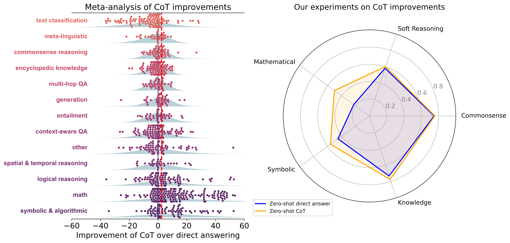

<p align="center">
  <a href="https://arxiv.org/abs/2409.12183" target="_blank">
    <picture>
      <source media="(prefers-color-scheme: light)" width="400px" srcset="./imgs/fig1.png">
      
    </picture>
  </a>
</p>

<h1 align="center">To CoT or To Not CoT?</h1>
<h3 align="center" style="font-size: 20px; margin-bottom: 4px">Chain-of-thought helps mainly on math and symbolic reasoning</h3>
<br/>

## Overview

This repository contains the code for the paper [To CoT or To Not CoT? Chain-of-thought helps mainly on math and symbolic reasoning](https://arxiv.org/abs/2409.12183), including scripts to recreate the analysis figures and the custom evaluations.

The data collected from our evaluations are contained in the [Huggingface Collection](https://huggingface.co/collections/TAUR-Lab/cot-analysis-project-66bbb9e5e0156e65059895f5). Additionally the data used for the meta-analysis examining the benefits of CoT reported across papers appearing in top conferences such as ICLR, EACL, and NAACL 2024, can be found [here](https://docs.google.com/spreadsheets/d/1zCxzKUg9BrbNfqJY1BEmNgCN0d38jaF8ads4Dyt5nbE/edit?usp=sharing)

# 🛠️ Installation

## Dependencies

python3.9 is supported (other versions may run into dependency issues)

```terminal
pip install -r requirements.txt
```

## Keys (OpenAI / Claude / etc.)

Fill the API keys for the models you would like to run in `key_handler.py`

Most script already will set the os environment variables for you, but you can manually set them by importing this file and calling the set env function.

```python
from key_handler import KeyHandler
#...
KeyHandler.set_env_key()
```

### Installing Gemini

To get Gemini working you need a `google_service_key.json`, a project ID, a project location, threshold limits setup (on the console) and then to be logged in via the CLI.  There has to be an easier way, but for now that's how this was setup.

## [Optional] Install Redis for caching  

We cache all LLM calls (openai and huggingface) with keys based on the prompt and model parameters to speed up evaluations.

To do this, we used [Redis](https://redis.io/docs/clients/python/)

Easiest way to install it is (for linux)
1. `apt-get install redis`
2. `redis-server`

Alternatively you can run our code without redis or disable the cache entirely by commenting out the lines `cache.enable()`.

# 🚀Quick start
```python
"""Example script to show how the main components of our repo work."""

# Set up the cache (re-running the script with the same prompts will not call the thirdparty endpoint.)
from src import cache
cache.enable()

from src.model.model import Model
from key_handler import KeyHandler
from eval_datasets.types.gsm8k import GSM8KDataset

# Sets all of your environment variables, all that's needed for this script is OPENAI_API_KEY.
KeyHandler.set_env_key()

# Define the model
model = Model.load_model('openai/gpt-4o-mini-2024-07-18')

# Define the dataset
dataset = GSM8KDataset()

# Get an example and it's zero shot cot/direct answer prompts, then get the models response for both.
example = dataset[0]

zs_cot_prompt = example['zs_cot_messages']
zs_directanswer_prompt = example['zs_cotless_messages']

models_cot_response = model.parse_out(model.inference(zs_cot_prompt))
print(f'Models CoT Response:\n{models_cot_response[0]}')

models_directanswer_response = model.parse_out(model.inference(zs_directanswer_prompt))

# Answer parsing using our custom answer parsers (every dataset has their own special parsers, but a lot of them share
# the same rules)
examples_cot_metrics = dataset.evaluate_response(models_cot_response, example)
examples_directanswer_metrics = dataset.evaluate_response(models_directanswer_response, example)

print(f"The correct answer: {example['answer']}")

answer_span_in_cot_response = examples_cot_metrics[0]["answer_span"]
print(f'CoTs extracted answer: {examples_cot_metrics[0]["model_response"][answer_span_in_cot_response[0]:answer_span_in_cot_response[1]]}')

print (f"CoT was correct: {examples_cot_metrics[0]['correct']}")
print(f"Direct Answer was correct: {examples_directanswer_metrics[0]['correct']}")
```

# 📖 Tutorial

We have a [tutorial notebook]() to help users go more indepth on how the code works and how to run your own custom evaluations.

# Recreating results from the paper


## Zero-shot vs Few-shot vs CoT vs Direct Answer

This analysis is done per model and can be uploaded to your Huggingface repo but will also be stored locally.

To run it:
```terminal
cd experiments/section_4__cot_evals
python -m zeroshot_cot_experiments.py --model=openai/gpt-4o-mini-2024-07-18 --output_folder=./outs/test --eval_model=openai/gpt-4o-mini-2024-07-18 --num_samples=10 --is_closed_source=True --skip_fs_direct --skip_fs_cot --datasets agieval_lsat_lr agieval_lsat_ar agieval_lsat_rc
```

The above will run only 10 questions from the 3 AGIEval `lsat` slices.

- You can see the models that are available in `src/model` and how they are initialized in `model.py` load_model fn.

  - OpenAI/Claude/Gemini models use their normal API names prefaced with `openai`
  - Huggingface models must be hosted somewhere with vLLM and then you can call them via `--model=vllm_endpoint/http://127.0.0.1:60271/v1/completions<model>deepseek-ai/DeepSeek-R1-Distill-Llama-70B`
  
- See all datasets that are allowed in the file `zeroshot_cot_experiments.py` at the bottom.

- eval_model is the model we use as an LLM-as-a-judge (for Biggen Bench)
 
- You can skip individual experiment settings like FewShot CoT via `--skip_fs_cot`
 
### Note
Because the datasets are changing on Huggingface and Llama 3.1 evals are no longer there (Llama changes their eval repos) our script uses the prompts stored in our own HF repo to keep everything reproducible.

## Plots, Charts, and Analyses

We include in this repo all the main figures and analyses from our paper.  However, they all pull from our google sheets or Huggingface Repo.  If you want to reproduce our results with your own data, you'll have to update how we load in the data (though that should be pretty easy). We are noting this here just so people know that the outputs from `zeroshot_cot_experiments.py` are not automatically hooked into all the plotting scripts.

## Calling Models

We made our own special way to call models :P 

You can see examples in `scripts/example__calling_models.py` for details on how to do it. Really it was just a way for us to unify calling stuff back before a ton of other packages came out that did this.
